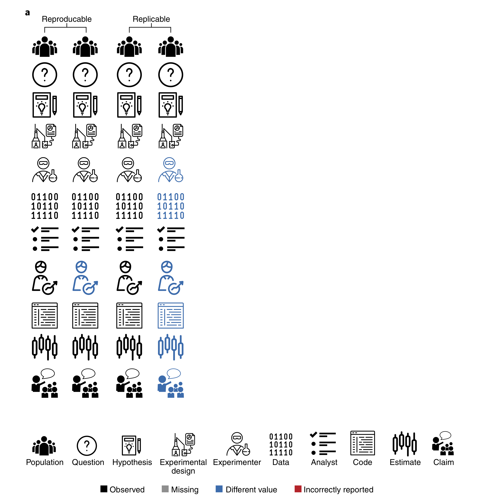

```{r setup, include=FALSE}
knitr::opts_chunk$set(echo = FALSE)
```

```{r}
library(knitr)
```


## Overview

- What is reproducibility?
- Source of bias
- Experimental Design
- Replication (n = ?)
- Recommendations

<p>&nbsp;</p>
<p>&nbsp;</p>

Source: https://github.com/tschauer

## Reference Book


```{r, echo=FALSE, fig.align='center', out.width = "200px"}

```

\begin{center}
Patil, Peng and Leek, 2019
\end{center}
<center>


## Reproducibility vs. replicablity

```{r, echo=FALSE, fig.align='center', out.width = "200px"}

```

\begin{center}
Patil, Peng and Leek, 2019
\end{center}
<center>


## Reproducibility vs. replicablity


```{r, echo=FALSE, fig.align='center', out.width = "200px"}
include_graphics("files/repro_repli2.png")
```

\begin{center}
Patil, Peng and Leek, 2019
\end{center}
<center>

## Reproducibility by Lazic

- **analytical**: original data and analysis (code!)
- **direct**: same conditions, materials, methods
- **systematic**: different conditions (e.g. cell line, KD vs drug)
- **conceptual**: general under diverse conditions (paradigm)


## Source of bias

* Strategy: which location was bombed randomly?

```{r, fig.align='center', fig.height=3.5, fig.width=5}
par(mfrow=c(1,2), oma=c(3,3,3,3), mar=c(1,1,2,0), cex.main=0.9)

set.seed(31)

plot(rnorm(100, mean = 5, sd = 3), rnorm(100, mean = 5, sd = 3), 
     pch=4, cex=0.6, main = "A",
     xlim = c(1,10), ylim =c(1,10), xlab="", ylab="", xaxt="n", yaxt="n")

set.seed(22)
plot(rep(1:10, each=10)+rnorm(100,sd=0.4), rep(1:10, time=10)+rnorm(100,sd=0.4),
     pch=4, cex=0.6, main = "B",
     xlim = c(1,10), ylim =c(1,10), xlab="", ylab="", xaxt="n", yaxt="n")

mtext(text = "Longitude", side = 1, outer = T, cex = 0.7)
mtext(text = "Latitude", side = 2, outer = T, cex = 0.7)

```

## Source of bias

* seeing pattern in randomness
* not wanting to miss anything (what else can we get out?)
* *if a hypthesis is derived from the data, then the ability of the data to support that hypothesis is diminished*
* exploratory vs. confirmatory research

## Source of bias

* psychological cliff at p = 0.05 

<p>&nbsp;</p>

```{r, fig.align='center', fig.height=4.5, fig.width=5}
par(mfrow=c(1,1), oma=c(3,3,3,3), mar=c(4,4,4,0), cex.lab=0.8, cex.axis=0.8)

x <- seq(0,1,0.01)

plot(x, rev(x), type="l", xlab="p-value", ylab="Confidence in hypothesis")
axis(side = 1, at = 0.05, line = 1)

lines(x, exp(-5*x))

lines(x, c(seq(1,0.92, length.out = 5), seq(0.90,0.1, length.out = 3) ,seq(0.1,0, length.out = 93)))


rect(xleft = 0, xright = 0.05, ybottom = 0, ytop = 1, col = rgb(0,0,0,0.5), border = NA)

```


## Source of bias

* neglect of sampling variability 

```{r, fig.align='center', fig.height=4.5, fig.width=5}
par(mfrow=c(1,1), oma=c(3,3,3,3), mar=c(4,4,4,0), cex.lab=0.8, cex.axis=0.7)

set.seed(3)

dat <- list(exp1 = rnorm(10, 0.5, 1),
           exp2 = rnorm(10, 0.5, 1),
           exp3 = rnorm(10, 0.5, 1),
           exp4 = rnorm(10, 0.5, 1),
           exp5 = rnorm(10, 0.5, 1),
           exp6 = rnorm(10, 0.5, 1),
           exp7 = rnorm(10, 0.5, 1),
           exp8 = rnorm(10, 0.5, 1),
           exp9 = rnorm(10, 0.5, 1),
           exp10 = rnorm(10, 0.5, 1))

bplot <- barplot(unlist(lapply(dat, FUN = function(x){t.test(x)$est})),
                 names.arg = names(dat),
                 ylab="Mean +/- 95% CI",  main="", las=2, ylim = c(-1,2))

abline(h = 0.5, lty=3)

arrows(x0=bplot,
       y0=unlist(lapply(dat, FUN = function(x){t.test(x)$conf[1]})),
       y1=unlist(lapply(dat, FUN = function(x){t.test(x)$conf[2]})),
       angle=90,code=3,length=0.05)

```


* mean = 0.5, standard deviation = 1, n=10 each


## Source of bias

* lack of independence
<p>&nbsp;</p>
    + repeated measures
        + observations are close together in space or time
        + same animal, litter, cell culture dish, fly vial
    + correlated variables
        + different measures of a single underlying effect
        + co-regulated genes, proteins, metabolites
        + disease severity 


## Source of bias

* confirmation bias
<p>&nbsp;</p>
    + Pubmed search: disease + gene name
        + what about studies which do not find the association?
        + neglecting negative results
    + data transformation until it "gets" significant
    + selecting data to tell the story (data that do not fit excluded)

## Source of bias

* expectancy effects (measurements are influenced)
* hindsight bias ('I knew it all along')
* herding effect (scientific inbreeding)

## Common problems

* Experimental Design
<p>&nbsp;</p>
    + confounding (conditions ~ biological, technical effects)
    + experimental unit (replicates)
    + lack of randomization
    + low statistical power
<p>&nbsp;</p>
* Conducting experiments
<p>&nbsp;</p>
    + lack of blinding
    + lack of randomization
    + optional stopping

## Common problems

* Analysis
<p>&nbsp;</p>
    + experimental unit (inflated sample size)
    + inapproriate model (normal distribution)
    + incorrect interpretation
    + selective reporting

## Experimental Goal


```{r, results='asis'}
dt <- data.frame(Exploratory = c("General","Generating","Before",
                                 "Data dependent", "False Negatives", "No Diagnostic Value"),
                 Confirmatory = c("Specific","Before","After (independent data)",
                                  "Data independent", "False Positives","Diagnostic Value"))

rownames(dt) <- c("Question","Hypothesis","Order","Analysis","Minimize", "P-value")

kable(dt)
```

```{r, echo=FALSE, eval=F, fig.align='left', out.width = "50px"}

```

* Pre-registration: https://cos.io/prereg/

## Experimental Goal

```{r, results='asis'}

dt <- data.frame(Exploratory = c("Heterogeneous", "Varied",     "Many","Many","Many", "Many","Few","Possibly","Yes","Yes"),
                Confirmatory = c("Homogeneous", "Standardised","Few", "Few",  "Few",  "Few", "Many", "Yes","Yes","Yes"))

rownames(dt) <- c("Subjects","Environment","Treatments","Levels",
                  "Time points","Outcome","Controls","Blinding","Randomization","Blocking")
kable(dt)
```


