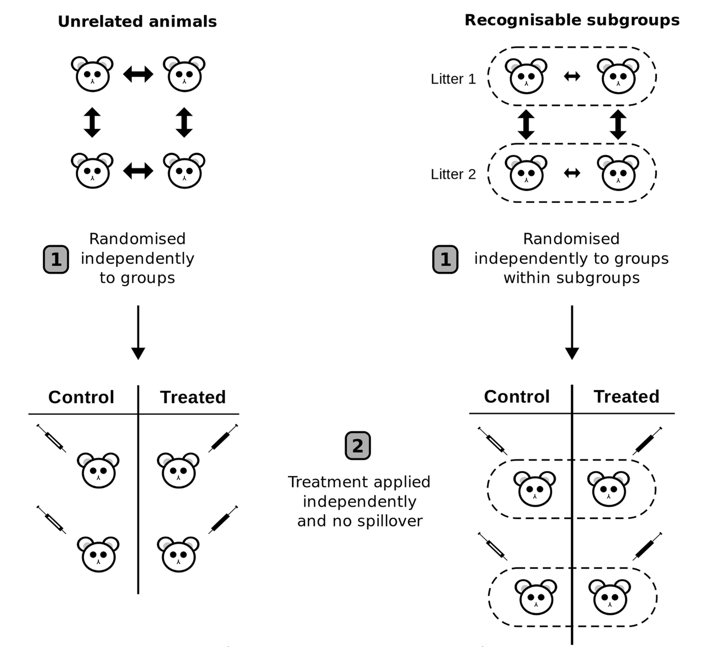

```{r setup, include=FALSE}
knitr::opts_chunk$set(echo = FALSE)
```

```{r}
library(knitr)
```


## Overview

- What is reproducibility?
- Source of bias
- Experimental Design
- Replication (N = ?)
- Recommendations

<p>&nbsp;</p>
<p>&nbsp;</p>

Source: https://github.com/tschauer/Reprodicibility_ExpDesign

## Reference Book


```{r, echo=FALSE, fig.align='center', out.width = "200px"}
include_graphics("files/EDLB_image.png")
```

\begin{center}
Lazic, 2016
\end{center}
<center>


## Reproducibility vs. replicability

```{r, echo=FALSE, fig.align='center', out.width = "200px"}
include_graphics("files/repro_repli1.png")
```

\begin{center}
Patil, Peng and Leek, 2019
\end{center}
<center>


## Reproducibility vs. replicability


```{r, echo=FALSE, fig.align='center', out.width = "200px"}
include_graphics("files/repro_repli2.png")
```

\begin{center}
Patil, Peng and Leek, 2019
\end{center}
<center>

## Reproducibility by Lazic

- **analytical**: original data and analysis (code!)
- **direct**: same conditions, materials, methods
- **systematic**: different conditions (e.g. cell line, KD vs drug)
- **conceptual**: general under diverse conditions (paradigm)


## Source of bias

* Strategy: which location was bombed randomly?

```{r, fig.align='center', fig.height=3.5, fig.width=5}
par(mfrow=c(1,2), oma=c(3,3,3,3), mar=c(1,1,2,0), cex.main=0.9)

# set.seed(31)
# 
# plot(rnorm(100, mean = 5, sd = 3), rnorm(100, mean = 5, sd = 3), 
#      pch=4, cex=0.6, main = "A",
#      xlim = c(1,10), ylim =c(1,10), xlab="", ylab="", xaxt="n", yaxt="n")

set.seed(30)

plot(runif(100, 0, 10), runif(100, 0, 10), 
     pch=4, cex=0.6, main = "A",
     xlim = c(1,10), ylim =c(1,10), xlab="", ylab="", xaxt="n", yaxt="n")

set.seed(22)
plot(rep(1:10, each=10)+rnorm(100,sd=0.25), rep(1:10, time=10)+rnorm(100,sd=0.25),
     pch=4, cex=0.6, main = "B",
     xlim = c(1,10), ylim =c(1,10), xlab="", ylab="", xaxt="n", yaxt="n")

mtext(text = "Longitude", side = 1, outer = T, cex = 0.7)
mtext(text = "Latitude", side = 2, outer = T, cex = 0.7)

```

## Source of bias

* seeing pattern in randomness
* not wanting to miss anything (what else can we get out?)
* *"if a hypothesis is derived from the data, then the ability of the data to support that hypothesis is diminished"*
* exploratory vs. confirmatory research

## Source of bias

* psychological cliff at p = 0.05 

<p>&nbsp;</p>

```{r, fig.align='center', fig.height=4.25, fig.width=4.75}
par(mfrow=c(1,1), oma=c(3,3,3,3), mar=c(4,4,4,0), mgp = c(1.5,0.5,0), cex.lab=0.7, cex.axis=0.7)

x <- seq(0,1,0.01)

plot(x, rev(x), type="l", xlab="p-value", ylab="Confidence in hypothesis")
axis(side = 1, at = 0.05, line = 1)

lines(x, exp(-5*x))

lines(x, c(seq(1,0.92, length.out = 5), seq(0.90,0.1, length.out = 3) ,seq(0.1,0, length.out = 93)))


rect(xleft = 0, xright = 0.05, ybottom = 0, ytop = 1, col = rgb(0,0,0,0.5), border = NA)

```

original study: Poitevineau and Lecoutre, 2001

## Source of bias

* neglect of sampling variability 

```{r, fig.align='center', fig.height=4.5, fig.width=5}
par(mfrow=c(1,1), oma=c(3,3,3,3), mar=c(4,4,4,0), cex.lab=0.8, cex.axis=0.7)

set.seed(4)

dat <- list(exp1 = rnorm(10, 0.5, 1),
            exp2 = rnorm(10, 0.5, 1),
            exp3 = rnorm(10, 0.5, 1),
            exp4 = rnorm(10, 0.5, 1),
            exp5 = rnorm(10, 0.5, 1),
            exp6 = rnorm(10, 0.5, 1),
            exp7 = rnorm(10, 0.5, 1),
            exp8 = rnorm(10, 0.5, 1),
            exp9 = rnorm(10, 0.5, 1))

bplot <- barplot(unlist(lapply(dat, FUN = function(x){t.test(x)$est})),
                 names.arg = names(dat),
                 ylab="Mean +/- 95% CI",  main="", las=2, ylim = c(-1,2))

abline(h = 0.5, lty=3)

arrows(x0=bplot,
       y0=unlist(lapply(dat, FUN = function(x){t.test(x)$conf[1]})),
       y1=unlist(lapply(dat, FUN = function(x){t.test(x)$conf[2]})),
       angle=90,code=3,length=0.05)

```


* mean = 0.5, standard deviation = 1, n=10 each


## Source of bias

* lack of independence
<p>&nbsp;</p>
  + repeated measures
    + observations are close together in space or time
    + same animal, litter, cell culture dish, fly vial
  + correlated variables
    + different measures of a single underlying effect
    + co-regulated genes, proteins, metabolites
    + disease severity 


## Source of bias

* confirmation bias
<p>&nbsp;</p>
  + Pubmed search: disease + gene name
    + what about studies which do not find the association?
    + neglecting negative results
  + data transformation until it "gets" significant
  + selecting data to tell the story (data that do not fit excluded)

## Source of bias

* expectancy effects (measurements are influenced)
* hindsight bias ('I knew it all along')
* herding effect (scientific inbreeding)

## Common problems

* Experimental Design
<p>&nbsp;</p>
  + confounding (conditions ~ biological, technical effects)
  + experimental unit (replicates)
  + lack of randomization
  + low statistical power
<p>&nbsp;</p>
* Conducting experiments
<p>&nbsp;</p>
  + lack of blinding
  + lack of randomization
  + optional stopping

## Common problems

* Analysis
<p>&nbsp;</p>
  + experimental unit (inflated sample size)
  + inapproriate model (normal distribution)
  + incorrect interpretation
  + selective reporting

## Experimental Goal


```{r, results='asis'}
dt <- data.frame(Exploratory = c("General","Generating","Before",
                                 "Data dependent", "False Negatives", "No Diagnostic Value","Rarely"),
                 Confirmatory = c("Specific","Before","After (independent data)",
                                  "Data independent", "False Positives","Diagnostic Value","Yes"))

rownames(dt) <- c("Question","Hypothesis","Order","Analysis","Minimize", "P-value", "Power Analysis")

kable(dt)
```

```{r, echo=FALSE, eval=F, fig.align='left', out.width = "50px"}
include_graphics("files/preregistered.png")
```


## Experimental Goal

```{r, results='asis'}

dt <- data.frame(Exploratory = c("Heterogeneous", "Varied",     "Many","Many","Many", "Many","Few","Possibly","Yes","Yes"),
                 Confirmatory = c("Homogeneous", "Standardized","Few", "Few",  "Few",  "Few", "Many", "Yes","Yes","Yes"))

rownames(dt) <- c("Subjects","Environment","Treatments","Levels",
                  "Time points","Outcome","Controls","Blinding","Randomization","Blocking")
kable(dt)
```

## Hypothesis testing?

* p-value?
<p>&nbsp;</p>
  + A: "Given these data what is the probability that the null hypothesis is true"
  + B: "Given that the null hypothesis is true, what is the probability of these (or more extreme) data"
<p>&nbsp;</p>
* "The Earth is round (p < .05)" Cohen, 1994
<p>&nbsp;</p>
* Solution? Pre-registration: https://cos.io/prereg/

## Experimental Design Equation

\small

```{r, results='asis'}

dt <- data.frame('Outcome = ' = c("Gene exp.","Protein", "Cell counts", "","",""),
                 'Treatment + ' = c("Environment", "Compound","Inhibitor","siRNA", "Dose","Time"),
                 'Biological + ' = c("Sex", "Age","Weight","Litter","Genotype","Cell line"),
                 'Technical + ' = c("Person","Batch","Flask","Cage","Day","Incubator"),
                 'Error' = c("Experimental","Treatment","Sampling","Measurement","",""), check.names = F)

kable(dt)
```


## Randomization

```{r, echo=FALSE, fig.align='center', out.width = "200px"}

```

* Completely randomized vs. randomized blocked design

\begin{center}
Lazic, 2018
\end{center}
<center>

## 2-factor design

* crossed

\small


```{r, results='asis'}
dt <- data.frame(Control = c("*****", "*****"),
                 Treated = c("*****","*****"))

rownames(dt) <- c("Day 1", "Day 2")

kable(dt)

```


* nested

\small

```{r, results='asis'}
dt <- data.frame(Control = c("*****", "*****","",""),
                 Treated = c("","","*****","*****"))

rownames(dt) <- c("Cage 1", "Cage 2", "Cage 3", "Cage 4")

kable(dt)
```


## 2-factor design


* confounded

\small

```{r, results='asis'}
dt <- data.frame(Control = c("**********", ""),
                 Treated = c("","**********"))

rownames(dt) <- c("Batch 1", "Batch 2")

kable(dt)
```

## Batch effects

* 3 conditions, 4 reps in 2 batches

```{r, fig.align='center', fig.height=4, fig.width=5.5, message=F, warning=F, echo=F, results='hide'}

SampleTable <- read.table("counts/SampleTable.txt", header = T, sep="\t", stringsAsFactors = F)

SampleTable <- SampleTable[order(SampleTable$Name),]

SampleTable$Conditions <- factor(SampleTable$Conditions)


source("functions/makeCountTable.R")

myCount_Dir <- "counts/" 

myCount_Files <- list.files(path = myCount_Dir, pattern = ".*.out.tab")

myCount_File_Path <- file.path(myCount_Dir, myCount_Files)


read.counts <-  makeCountTable(count_files = myCount_Files, 
                               count_file_path = myCount_File_Path,
                               stranded = TRUE)


read.counts_genes <- read.counts[grep("^FBgn", rownames(read.counts)),]


source("functions/setupDDS.R")

dds.read <- setupDDS(CountTableName = "read.counts_genes", 
                     SampleTableName = "SampleTable",
                     SampleIdName = "Name", 
                     ConditionsName = "Conditions", 
                     BatchName = "Batch",
                     n_samples_for_filtering = 3)


my_conditions <- colData(dds.read)$Sample


log2_counts_uncor <- log2(counts(dds.read, normalized = TRUE)+1)

batchVar <- colData(dds.read)$Batch

library(sva)

modcombat <- model.matrix(~Sample, data = colData(dds.read))
log2_counts_bcor1 <- ComBat(dat = log2_counts_uncor, batch = batchVar, mod = modcombat, par.prior = TRUE, prior.plots = FALSE)


source("functions/plottingPCA.R")

cbPalette <- c("#999999", "#0072B2", "#CC79A7", "#009E73", "#E69F00", "#D55E00", "#56B4E9", "#F0E442")

my_limits <- c(-100,100)

par(mfrow=c(1,2), oma=c(3,3,3,3), mar=c(4,4,4,0), mgp = c(1.5,0.5,0), cex.main=0.7, cex.lab=0.6, cex.axis=0.6)

plottingPCA(my_data = log2_counts_uncor,
            color_palette = cbPalette,
            conditions = my_conditions, 
            my_limits = my_limits,
            point_size = 0.6,
            show_labels = F,
            my_title = "Before")


plottingPCA(my_data = log2_counts_bcor1,
            color_palette = cbPalette,
            conditions = my_conditions, 
            my_limits = my_limits,
            point_size = 0.6,
            show_labels = F,
            my_title = "After")


```

Data: Catherine Regnard


## Example

* How does Christmas affect human body weight?
<p>&nbsp;</p>


```{r, fig.align='center', fig.height=3.3, fig.width=4.5}
library(beeswarm)
par(mfrow=c(1,2), oma=c(3,3,3,3), mar=c(2,4,2,0), mgp = c(1.5,0.5,0), cex.main=0.7, cex.lab=0.6, cex.axis=0.6)

n = 1

set.seed(1)
dt <- data.frame(Weight = c(rnorm(n, mean = 70, sd = 1),
                            rnorm(n, mean = 80, sd = 1)),
                 Time = factor(rep(c("Before", "After"), each=n), levels = c("Before", "After")))

beeswarm(Weight ~ Time, data = dt, pch=19, xlab="", cex=0.8, ylim=c(50,100), main = "Xmas effect")
```


## Example

* measuerment error (3x within minutes)
<p>&nbsp;</p>

```{r, fig.align='center', fig.height=3.3, fig.width=4.5}
library(beeswarm)
par(mfrow=c(1,2), oma=c(3,3,3,3), mar=c(2,4,2,0), mgp = c(1.5,0.5,0), cex.main=0.7, cex.lab=0.6, cex.axis=0.6)

n = 3

set.seed(1)
dt <- data.frame(Weight = c(rnorm(n, mean = 70, sd = 0.25),
                            rnorm(n, mean = 80, sd = 0.25)),
                 Time = factor(rep(c("Before", "After"), each=n), levels = c("Before", "After")))

beeswarm(Weight ~ Time, data = dt, pch=19, xlab="", cex=0.8, ylim=c(50,100), main = "Xmas effect")
```

* qPCR well-replicates
* sequencing the same library


## Example

* Different days same person
<p>&nbsp;</p>

```{r, fig.align='center', fig.height=3.3, fig.width=4.5}
library(beeswarm)
par(mfrow=c(1,2), oma=c(3,3,3,3), mar=c(2,4,2,0), mgp = c(1.5,0.5,0), cex.main=0.7, cex.lab=0.6, cex.axis=0.6)

n = 3

set.seed(1)
dt <- data.frame(Weight = c(rnorm(n, mean = 70, sd = 2),
                            rnorm(n, mean = 80, sd = 2)),
                 Time = factor(rep(c("Before", "After"), each=n), levels = c("Before", "After")))

beeswarm(Weight ~ Time, data = dt, pch=19, xlab="", cex=0.8, ylim=c(50,100), main = "Xmas effect")


text(x = 1.5, y = 50, labels = paste("p-value <",
                                     format(t.test(Weight ~ Time, data = dt)$p.val, digits = 2, scientific = T)),
     cex = 0.6)

```

* Christmas signficantly increases human body weight ???
* e.g. cell culture experiments (generalizable?)


## Example

* Different years same person
<p>&nbsp;</p>

```{r, fig.align='center', fig.height=3.3, fig.width=4.5}
library(beeswarm)
par(mfrow=c(1,2), oma=c(3,3,3,3), mar=c(2,4,2,0), mgp = c(1.5,0.5,0), cex.main=0.7, cex.lab=0.6, cex.axis=0.6)

n = 3

set.seed(2)

y1 <- rnorm(n, mean = 70, sd = 3)

y2 <- y1 + 10 + rnorm(n, mean = 0, sd = 1)

dt <- data.frame(Weight = c(y1,y2),
                 Time = factor(rep(c("Before", "After"), each=n), levels = c("Before", "After")))

beeswarm(Weight ~ Time, data = dt, pch=19,
         xlab="", cex=0.8, ylim=c(50,100), main = "Xmas effect")


text(x = 1.5, y = 50, labels = paste("p-value <",
                                     format(t.test(Weight ~ Time, data = dt)$p.val, digits = 2, scientific = T)),
     cex = 0.6)

```

* year can be used as grouping factor


## Example

* Different years same person
<p>&nbsp;</p>

```{r, fig.align='center', fig.height=3.3, fig.width=4.5}
library(beeswarm)
par(mfrow=c(1,2), oma=c(3,3,3,3), mar=c(2,4,2,0), mgp = c(1.5,0.5,0), cex.main=0.7, cex.lab=0.6, cex.axis=0.6)

n = 3

set.seed(2)

y1 <- rnorm(n, mean = 70, sd = 3)

y2 <- y1 + 10 + rnorm(n, mean = 0, sd = 1)

dt <- data.frame(Weight = c(y1,y2),
                 Time = factor(rep(c("Before", "After"), each=n), levels = c("Before", "After")))

beeswarm(Weight ~ Time, data = dt, pch=19,
         xlab="", cex=0.8, ylim=c(50,100), main = "Xmas effect")

segments(x0 = rep(1, each=n), y0 = dt$Weight[1:n],
         x1 = rep(2, each=n), y1 = dt$Weight[(n+1):(2*n)])

text(x = 1.5, y = 50, labels = paste("p-value <",
                                     format(t.test(Weight ~ Time, data = dt, paired=T)$p.val, digits = 2, scientific = T)),
     cex = 0.6)

```

* it is still just a single person
* different years not always applicable


## What is N?

* within sample testing (comparing set of genes)

```{r, fig.align='center', fig.height=3.9, fig.width=4.75}
library(beeswarm)
par(mfrow=c(1,2), oma=c(3,3,3,3), mar=c(2,4,2,0), mgp = c(1.5,0.5,0), cex.main=0.7, cex.lab=0.6, cex.axis=0.6)


set.seed(2)

y1 <- rnorm(12000, mean = 0, sd = 2.5)

y2 <- rnorm(3000, mean = -0.25, sd = 2.25)


boxplot(list(Set1 = y1, Set2 = y2), 
        col = c("darkgrey","darkred"),
        ylab = "log2 Fold Change",
        notch = F,
        outline = F, ylim = c(-8,8))

abline(h=0)

text(x = 1.5, y = 7.5, labels = paste("p-value <",
                                      format(wilcox.test(y1,y2)$p.val, digits = 2, scientific = T)),
     cex = 0.6)

text(x = c(1,2), y = -7.5, labels = paste("n =", c(length(y1),length(y2))),
     cex = 0.6)
```

* True difference: -0.25
* large number of genes inflates p-value (no diagnostic value)

## What is N?

* Biological unit (BU): the entity about which inferences are made.
* Experimental unit (EU): the entity that is randomly and independently assigned. Sample size N = EU.
<p>&nbsp;</p>
  + BU of interest
  + groups of BUs
  + parts of a BU
  + sequence of observations on a BU
<p>&nbsp;</p>
* Replicate EU to increase N!

<p>&nbsp;</p>
definitions by Lazic, 2016

## What is N?

* Observational unit (OU): the entity on which measurements are taken. 
* More OUs do not increase N
  + e.g. cells from a single aliquot, well, slide
* Multiple OUs should be averaged (or use hierarchical model)!
* Report: what is EU, OU.

<p>&nbsp;</p>
definitions by Lazic, 2016


## Recommendations


* **Ask:** exploratory or confirmatory?
<p>&nbsp;</p>
* **Design:** conditions, batches, confounding
<p>&nbsp;</p>
* **Estimate:** effect size, variance, power
<p>&nbsp;</p>
* **Report:** what is your sampling N?
<p>&nbsp;</p>
* **Share:** lab protocol, raw data and analysis code


## Acknowledgements

* BMC, Bioinformatics
  + Tobias Straub
* BMC, Molecular Biology
  + collaborators
* Funding: SFB 1064

```{r, echo=FALSE, fig.align='center', out.width = "100px"}

```
